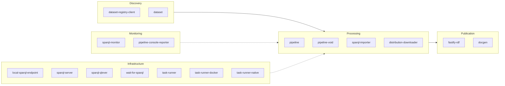

# LDE — Linked Data Engine

[](https://github.com/ldengine/lde/actions/workflows/ci.yml)
[](LICENSE)

Every organisation working with Linked Data ends up building the same
infrastructure from scratch: endpoint management, data import, SPARQL
transformation pipelines, dataset discovery.
**LDE** is a shared, open-source toolkit of composable Node.js libraries that
eliminates this duplication.
All data transformations are expressed as plain SPARQL queries — portable,
transparent and free of vendor lock-in.
LDE builds on open standards (SPARQL 1.1, SHACL, DCAT-AP 3.0, RDF/JS) and
originated at [Netwerk Digitaal Erfgoed](https://www.networkdigitalheritage.nl/)
(NDE), the Dutch national digital heritage network.

## Key capabilities

- **Discover** datasets from DCAT-AP 3.0 registries.
- **Download** and import data dumps to a local SPARQL endpoint for querying.
- **Transform** datasets with pure SPARQL CONSTRUCT queries — composable stages with fan-out item selection.
- **Analyse** datasets with VoID statistics and SPARQL monitoring.
- **Publish** results to SPARQL endpoints or local files.
- **Serve** RDF data over HTTP with content negotiation (Fastify plugin).
- YAML-based pipeline configuration (planned).

## Standards

| Standard                                                         | Usage in LDE                                                      |
| ---------------------------------------------------------------- | ----------------------------------------------------------------- |
| [SPARQL 1.1](https://www.w3.org/TR/sparql11-query/)              | All data transformations, dataset queries and endpoint management |
| [SHACL](https://www.w3.org/TR/shacl/)                            | Documentation generation from shapes (`@lde/docgen`)              |
| [DCAT-AP 3.0](https://semiceu.github.io/DCAT-AP/releases/3.0.0/) | Dataset discovery and registry queries                            |
| [VoID](https://www.w3.org/TR/void/)                              | Statistical analysis of RDF datasets (`@lde/pipeline-void`)       |
| [RDF/JS](https://rdf.js.org/)                                    | Internal data model (N3, Comunica)                                |
| [LDES](https://semiceu.github.io/LinkedDataEventStreams/)        | Event stream consumption (planned)                                |

## Architecture



## Quick example

```typescript
import {
  Pipeline,
  Stage,
  SparqlConstructExecutor,
  SparqlItemSelector,
  SparqlUpdateWriter,
  ManualDatasetSelection,
} from '@lde/pipeline';

const pipeline = new Pipeline({
  datasetSelector: new ManualDatasetSelection([dataset]),
  stages: [
    new Stage({
      name: 'per-class',
      itemSelector: new SparqlItemSelector({
        query: 'SELECT DISTINCT ?class WHERE { ?s a ?class }',
      }),
      executors: new SparqlConstructExecutor({
        query:
          'CONSTRUCT { ?class a <http://example.org/Class> } WHERE { ?s a ?class }',
      }),
    }),
  ],
  writers: new SparqlUpdateWriter({
    endpoint: new URL('http://localhost:7200/repositories/lde/statements'),
  }),
});

await pipeline.run();
```

## Packages

### Discovery

| Package                                                          | Version                                                                                                                         | Description                                               |
| ---------------------------------------------------------------- | ------------------------------------------------------------------------------------------------------------------------------- | --------------------------------------------------------- |
| [@lde/dataset](packages/dataset)                                 | [](https://www.npmjs.com/package/@lde/dataset)                                 | Core dataset and distribution objects                     |
| [@lde/dataset-registry-client](packages/dataset-registry-client) | [](https://www.npmjs.com/package/@lde/dataset-registry-client) | Retrieve dataset descriptions from DCAT-AP 3.0 registries |

### Processing

| Package                                                          | Version                                                                                                                         | Description                                                  |
| ---------------------------------------------------------------- | ------------------------------------------------------------------------------------------------------------------------------- | ------------------------------------------------------------ |
| [@lde/pipeline](packages/pipeline)                               | [](https://www.npmjs.com/package/@lde/pipeline)                               | Build pipelines that query, transform and enrich Linked Data |
| [@lde/pipeline-void](packages/pipeline-void)                     | [](https://www.npmjs.com/package/@lde/pipeline-void)                     | VoID statistical analysis for RDF datasets                   |
| [@lde/distribution-downloader](packages/distribution-downloader) | [](https://www.npmjs.com/package/@lde/distribution-downloader) | Download distributions for local processing                  |
| [@lde/sparql-importer](packages/sparql-importer)                 | [](https://www.npmjs.com/package/@lde/sparql-importer)                 | Import data dumps to a local SPARQL endpoint for querying    |

### Publication

| Package                                  | Version                                                                                                 | Description                                                         |
| ---------------------------------------- | ------------------------------------------------------------------------------------------------------- | ------------------------------------------------------------------- |
| [@lde/fastify-rdf](packages/fastify-rdf) | [](https://www.npmjs.com/package/@lde/fastify-rdf) | Fastify plugin for RDF content negotiation and request body parsing |
| [@lde/docgen](packages/docgen)           | [](https://www.npmjs.com/package/@lde/docgen)           | Generate documentation from RDF such as SHACL shapes                |

### Monitoring

| Package                                                              | Version                                                                                                                             | Description                                   |
| -------------------------------------------------------------------- | ----------------------------------------------------------------------------------------------------------------------------------- | --------------------------------------------- |
| [@lde/sparql-monitor](packages/sparql-monitor)                       | [](https://www.npmjs.com/package/@lde/sparql-monitor)                       | Monitor SPARQL endpoints with periodic checks |
| [@lde/pipeline-console-reporter](packages/pipeline-console-reporter) | [](https://www.npmjs.com/package/@lde/pipeline-console-reporter) | Console progress reporter for pipelines       |

### Infrastructure

| Package                                                      | Version                                                                                                                     | Description                                                       |
| ------------------------------------------------------------ | --------------------------------------------------------------------------------------------------------------------------- | ----------------------------------------------------------------- |
| [@lde/local-sparql-endpoint](packages/local-sparql-endpoint) | [](https://www.npmjs.com/package/@lde/local-sparql-endpoint) | Quickly start a local SPARQL endpoint for testing and development |
| [@lde/sparql-server](packages/sparql-server)                 | [](https://www.npmjs.com/package/@lde/sparql-server)                 | Start, stop and control SPARQL servers                            |
| [@lde/sparql-qlever](packages/sparql-qlever)                 | [](https://www.npmjs.com/package/@lde/sparql-qlever)                 | QLever SPARQL adapter for importing and serving data              |
| [@lde/wait-for-sparql](packages/wait-for-sparql)             | [](https://www.npmjs.com/package/@lde/wait-for-sparql)             | Wait for a SPARQL endpoint to become available                    |
| [@lde/task-runner](packages/task-runner)                     | [](https://www.npmjs.com/package/@lde/task-runner)                     | Task runner core classes and interfaces                           |
| [@lde/task-runner-docker](packages/task-runner-docker)       | [](https://www.npmjs.com/package/@lde/task-runner-docker)       | Run tasks in Docker containers                                    |
| [@lde/task-runner-native](packages/task-runner-native)       | [](https://www.npmjs.com/package/@lde/task-runner-native)       | Run tasks natively on the host system                             |

## Who uses LDE

<a href="https://netwerkdigitaalerfgoed.nl/en/">&nbsp;Netwerk Digitaal Erfgoed</a>

## Comparison

|                       | **LDE**                   | **TriplyETL**        | **rdf-connect**       | **Comunica**              | **Apache Jena**                   |
| --------------------- | ------------------------- | -------------------- | --------------------- | ------------------------- | --------------------------------- |
| **Focus**             | SPARQL-native pipelines   | RDF ETL platform     | RDF stream processing | Federated SPARQL querying | RDF storage and SPARQL processing |
| **Pipeline language** | SPARQL + TypeScript       | TypeScript DSL       | Declarative (RML)     | SPARQL                    | CLI / Java                        |
| **Lock-in**           | None — plain SPARQL files | Proprietary platform | Framework-specific    | None                      | None                              |
| **Licence**           | MIT                       | Proprietary          | MIT                   | MIT                       | Apache 2.0                        |

Comunica is complementary: LDE uses it internally as a query engine.

## Development

Prerequisites: Node.js (LTS) and npm.

```sh
npm install
npx nx run-many -t build
npx nx run-many -t test
npx nx affected -t lint test typecheck build  # only changed packages
```

See [CONTRIBUTING.md](CONTRIBUTING.md) for the full development workflow.

## Licence

MIT — see [LICENSE](LICENSE).

## Acknowledgements

LDE originated at the [Dutch national infrastructure for digital heritage](https://netwerkdigitaalerfgoed.nl/en/) (NDE).
