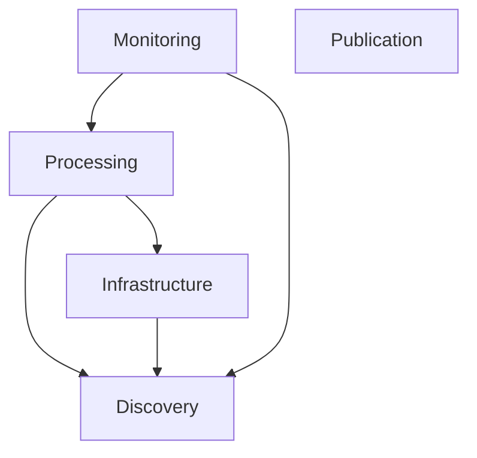
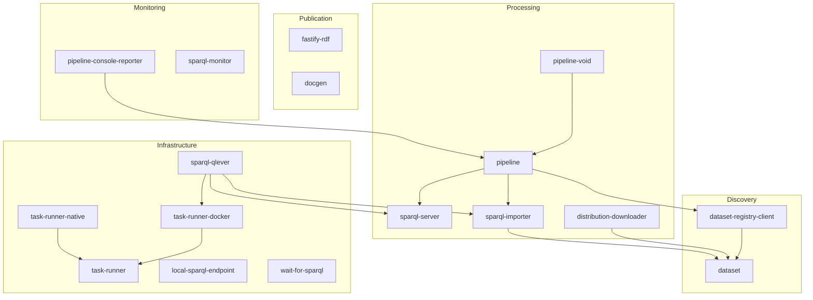
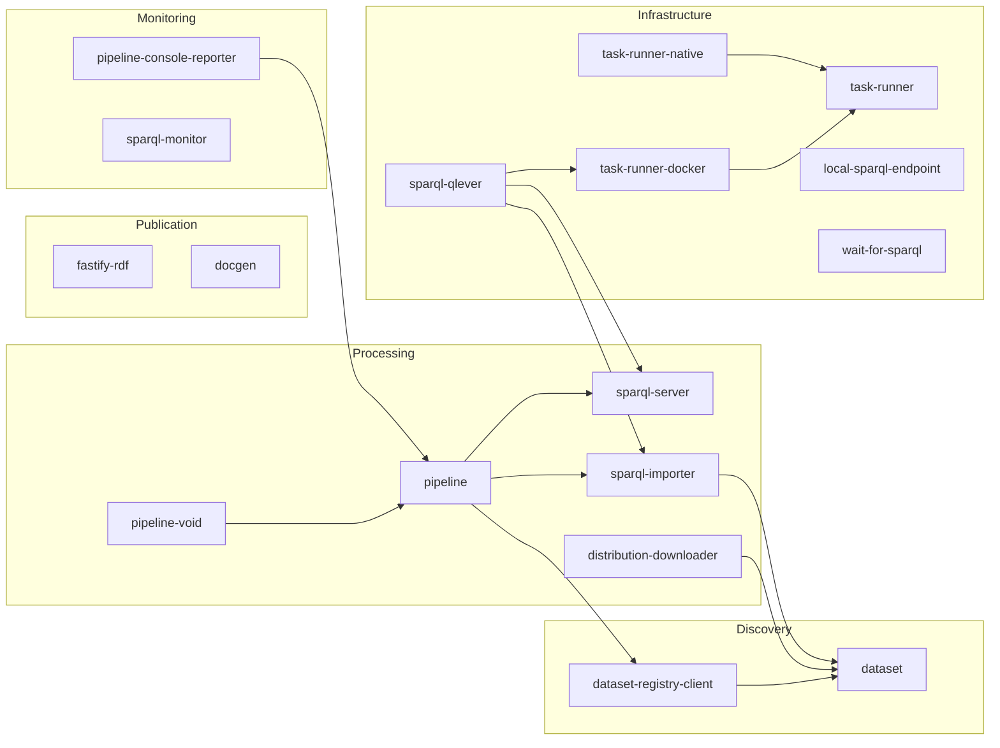

# LDE — Linked Data Engine

[](https://github.com/ldengine/lde/actions/workflows/ci.yml)
[](LICENSE)

Every organisation working with Linked Data ends up building the same
infrastructure from scratch: endpoint management, data import, SPARQL
transformation pipelines, dataset discovery.
**LDE** is a shared, open-source toolkit of composable Node.js libraries that
eliminates this duplication.
All data transformations are expressed as plain SPARQL queries — portable,
transparent and free of vendor lock-in.
LDE builds on open standards (SPARQL 1.1, SHACL, DCAT-AP 3.0, RDF/JS) and
originated at [Netwerk Digitaal Erfgoed](https://www.networkdigitalheritage.nl/)
(NDE), the Dutch national digital heritage network.

## Key capabilities

- **Discover** datasets from DCAT-AP 3.0 registries.
- **Download** and import data dumps to a local SPARQL endpoint for querying.
- **Transform** datasets with pure SPARQL CONSTRUCT queries — composable stages with fan-out item selection.
- **Analyse** datasets with VoID statistics and SPARQL monitoring.
- **Publish** results to SPARQL endpoints or local files.
- **Serve** RDF data over HTTP with content negotiation (Fastify plugin).
- YAML-based pipeline configuration (planned).

## Standards

| Standard                                                         | Usage in LDE                                                      |
| ---------------------------------------------------------------- | ----------------------------------------------------------------- |
| [SPARQL 1.1](https://www.w3.org/TR/sparql11-query/)              | All data transformations, dataset queries and endpoint management |
| [SHACL](https://www.w3.org/TR/shacl/)                            | Documentation generation from shapes (`@lde/docgen`)              |
| [DCAT-AP 3.0](https://semiceu.github.io/DCAT-AP/releases/3.0.0/) | Dataset discovery and registry queries                            |
| [VoID](https://www.w3.org/TR/void/)                              | Statistical analysis of RDF datasets (`@lde/pipeline-void`)       |
| [RDF/JS](https://rdf.js.org/)                                    | Internal data model (N3, Comunica)                                |
| [LDES](https://semiceu.github.io/LinkedDataEventStreams/)        | Event stream consumption (planned)                                |

## Architecture

### Variant A: Categories only



### Variant B: Categories + key packages



### Variant C: Categories + key packages (horizontal)



## Quick example

```typescript
import {
  Pipeline,
  Stage,
  SparqlConstructExecutor,
  SparqlItemSelector,
  SparqlUpdateWriter,
  ManualDatasetSelection,
} from '@lde/pipeline';

const pipeline = new Pipeline({
  datasetSelector: new ManualDatasetSelection([dataset]),
  stages: [
    new Stage({
      name: 'per-class',
      itemSelector: new SparqlItemSelector({
        query: 'SELECT DISTINCT ?class WHERE { ?s a ?class }',
      }),
      executors: new SparqlConstructExecutor({
        query:
          'CONSTRUCT { ?class a <http://example.org/Class> } WHERE { ?s a ?class }',
      }),
    }),
  ],
  writers: new SparqlUpdateWriter({
    endpoint: new URL('http://localhost:7200/repositories/lde/statements'),
  }),
});

await pipeline.run();
```

## Packages

<table>
<tr><th colspan="3" align="left">Discovery — Find and retrieve dataset descriptions from registries</th></tr>
<tr>
  <td><a href="packages/dataset">@lde/dataset</a></td>
  <td><a href="https://www.npmjs.com/package/@lde/dataset"></a></td>
  <td>Core dataset and distribution objects</td>
</tr>
<tr>
  <td><a href="packages/dataset-registry-client">@lde/dataset-registry-client</a></td>
  <td><a href="https://www.npmjs.com/package/@lde/dataset-registry-client"></a></td>
  <td>Retrieve dataset descriptions from DCAT-AP 3.0 registries</td>
</tr>
<tr><th colspan="3" align="left">Processing — Transform, enrich and analyse datasets with SPARQL pipelines</th></tr>
<tr>
  <td><a href="packages/pipeline">@lde/pipeline</a></td>
  <td><a href="https://www.npmjs.com/package/@lde/pipeline"></a></td>
  <td>Build pipelines that query, transform and enrich Linked Data</td>
</tr>
<tr>
  <td><a href="packages/pipeline-void">@lde/pipeline-void</a></td>
  <td><a href="https://www.npmjs.com/package/@lde/pipeline-void"></a></td>
  <td>VoID statistical analysis for RDF datasets</td>
</tr>
<tr>
  <td><a href="packages/distribution-downloader">@lde/distribution-downloader</a></td>
  <td><a href="https://www.npmjs.com/package/@lde/distribution-downloader"></a></td>
  <td>Download distributions for local processing</td>
</tr>
<tr>
  <td><a href="packages/sparql-importer">@lde/sparql-importer</a></td>
  <td><a href="https://www.npmjs.com/package/@lde/sparql-importer"></a></td>
  <td>Import data dumps to a local SPARQL endpoint for querying</td>
</tr>
<tr><th colspan="3" align="left">Publication — Serve and document your data</th></tr>
<tr>
  <td><a href="packages/fastify-rdf">@lde/fastify-rdf</a></td>
  <td><a href="https://www.npmjs.com/package/@lde/fastify-rdf"></a></td>
  <td>Fastify plugin for RDF content negotiation and request body parsing</td>
</tr>
<tr>
  <td><a href="packages/docgen">@lde/docgen</a></td>
  <td><a href="https://www.npmjs.com/package/@lde/docgen"></a></td>
  <td>Generate documentation from RDF such as SHACL shapes</td>
</tr>
<tr><th colspan="3" align="left">Monitoring — Observe pipeline runs and endpoint health</th></tr>
<tr>
  <td><a href="packages/sparql-monitor">@lde/sparql-monitor</a></td>
  <td><a href="https://www.npmjs.com/package/@lde/sparql-monitor"></a></td>
  <td>Monitor SPARQL endpoints with periodic checks</td>
</tr>
<tr>
  <td><a href="packages/pipeline-console-reporter">@lde/pipeline-console-reporter</a></td>
  <td><a href="https://www.npmjs.com/package/@lde/pipeline-console-reporter"></a></td>
  <td>Console progress reporter for pipelines</td>
</tr>
<tr><th colspan="3" align="left">Infrastructure — Manage SPARQL servers and run tasks</th></tr>
<tr>
  <td><a href="packages/local-sparql-endpoint">@lde/local-sparql-endpoint</a></td>
  <td><a href="https://www.npmjs.com/package/@lde/local-sparql-endpoint"></a></td>
  <td>Quickly start a local SPARQL endpoint for testing and development</td>
</tr>
<tr>
  <td><a href="packages/sparql-server">@lde/sparql-server</a></td>
  <td><a href="https://www.npmjs.com/package/@lde/sparql-server"></a></td>
  <td>Start, stop and control SPARQL servers</td>
</tr>
<tr>
  <td><a href="packages/sparql-qlever">@lde/sparql-qlever</a></td>
  <td><a href="https://www.npmjs.com/package/@lde/sparql-qlever"></a></td>
  <td>QLever SPARQL adapter for importing and serving data</td>
</tr>
<tr>
  <td><a href="packages/wait-for-sparql">@lde/wait-for-sparql</a></td>
  <td><a href="https://www.npmjs.com/package/@lde/wait-for-sparql"></a></td>
  <td>Wait for a SPARQL endpoint to become available</td>
</tr>
<tr>
  <td><a href="packages/task-runner">@lde/task-runner</a></td>
  <td><a href="https://www.npmjs.com/package/@lde/task-runner"></a></td>
  <td>Task runner core classes and interfaces</td>
</tr>
<tr>
  <td><a href="packages/task-runner-docker">@lde/task-runner-docker</a></td>
  <td><a href="https://www.npmjs.com/package/@lde/task-runner-docker"></a></td>
  <td>Run tasks in Docker containers</td>
</tr>
<tr>
  <td><a href="packages/task-runner-native">@lde/task-runner-native</a></td>
  <td><a href="https://www.npmjs.com/package/@lde/task-runner-native"></a></td>
  <td>Run tasks natively on the host system</td>
</tr>
</table>

## Who uses LDE

<a href="https://netwerkdigitaalerfgoed.nl/en/"></a>&ensp;<a href="https://netwerkdigitaalerfgoed.nl/en/">Netwerk Digitaal Erfgoed</a>

## Comparison

|                       | **LDE**                   | **TriplyETL**        | **rdf-connect**       |
| --------------------- | ------------------------- | -------------------- | --------------------- |
| **Focus**             | SPARQL-native pipelines   | RDF ETL platform     | RDF stream processing |
| **Pipeline language** | SPARQL + TypeScript       | TypeScript DSL       | Declarative (RML)     |
| **Lock-in**           | None — plain SPARQL files | Proprietary platform | Framework-specific    |
| **License**           | MIT                       | Proprietary          | MIT                   |

## Development

Prerequisites: Node.js (LTS) and npm.

```sh
npm install
npx nx run-many -t build
npx nx run-many -t test
npx nx affected -t lint test typecheck build  # only changed packages
```

See [CONTRIBUTING.md](CONTRIBUTING.md) for the full development workflow.

## License

MIT — see [LICENSE](LICENSE).

## Acknowledgements

LDE originated at the [Dutch national infrastructure for digital heritage](https://netwerkdigitaalerfgoed.nl/en/) (NDE).
