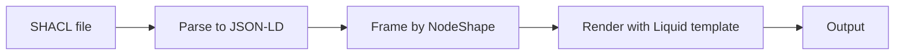

# @lde/docgen

Generate human-readable documentation from [SHACL](https://www.w3.org/TR/shacl/) shapes using [Liquid](https://liquidjs.com) templates.

- **Template-driven:** you control the output format (Markdown, HTML, plain text) with Liquid templates.
- **Standards-based:** reads any RDF serialization (Turtle, JSON-LD, N-Triples, etc.) via [rdf-dereference](https://github.com/rubensworks/rdf-dereference.js).
- **Structured output:** SHACL shapes are framed into a clean JSON-LD tree before rendering, so templates work with predictable, nested objects.

## How it works



1. **Parse** — the SHACL file is dereferenced and converted to JSON-LD.
2. **Frame** — the JSON-LD is [framed](https://www.w3.org/TR/json-ld11-framing/) using a JSON-LD Frame that selects `sh:NodeShape` resources and nests their property shapes. A default frame is included; you can supply your own.
3. **Render** — the framed data is passed to a Liquid template as `nodeShapes`, an array of node shape objects.

## CLI usage

```sh
npx @lde/docgen@latest from-shacl <shacl-file> <template-file> [options]
```

### Arguments

| Argument          | Description                                         |
| ----------------- | --------------------------------------------------- |
| `<shacl-file>`    | Path to a SHACL shapes file (any RDF serialization) |
| `<template-file>` | Path to a Liquid template file                      |

### Options

| Option               | Description                                                                                                                                          | Default                              |
| -------------------- | ---------------------------------------------------------------------------------------------------------------------------------------------------- | ------------------------------------ |
| `-f, --frame <file>` | Path to a JSON-LD Frame file. Deep-merged on top of the built-in default frame, so it only needs to contain your additions (e.g. extra `@context` entries). | Built-in `frames/shacl.frame.jsonld` |

### Example

Given a SHACL file `shapes.ttl`:

```turtle
@prefix dcat: <http://www.w3.org/ns/dcat#> .
@prefix dct:  <http://purl.org/dc/terms/> .
@prefix sh:   <http://www.w3.org/ns/shacl#> .
@prefix xsd:  <http://www.w3.org/2001/XMLSchema#> .

[] a sh:NodeShape ;
    sh:targetClass dcat:Dataset ;
    sh:property [
        sh:path dct:title ;
        sh:minCount 1 ;
    ] ,
    [
        sh:path dct:description ;
        sh:minCount 1 ;
        sh:datatype xsd:string ;
        sh:description "A description of the dataset"@en ;
    ] .
```

And a template `spec.md.liquid`:

```liquid

## {{ nodeShape.targetClass }}

| Property | Required | Type | Description |
|---|---|---|---|


| `{{ property.path }}` | {{ property.minCount | default: "no" }} | {{ property.datatype }} | {{ property.description | lang: "en" }} |


```

Run:

```sh
npx @lde/docgen@latest from-shacl shapes.ttl spec.md.liquid > spec.md
```

## Programmatic usage

```typescript
import { generateDocumentation } from '@lde/docgen';

const output = await generateDocumentation(
  'shapes.ttl',
  'spec.md.liquid',
  'frames/shacl.frame.jsonld', // optional: path to custom frame
);
```

## Template data

The Liquid template receives a `nodeShapes` array. Each node shape object has the structure produced by the JSON-LD Frame — keys are SHACL term names (`targetClass`, `property`, `name`, etc.) with IRIs as values.

Property shapes with the same `sh:path` are common in SHACL (e.g. one for cardinality, another for datatype). The `mergePropertiesByPath` filter combines them into a single object per path.

### Custom filters

| Filter                  | Description                                         | Example                                                             |
| ----------------------- | --------------------------------------------------- | ------------------------------------------------------------------- |
| `lang`                  | Select a value by language tag                      | `{{ property.description \| lang: "en" }}`                          |
| `mergePropertiesByPath` | Merge property shapes that share the same `sh:path` | `` |

## Custom frames

The default frame selects all `sh:NodeShape` resources and provides type coercions for common SHACL terms (`targetClass`, `path`, `severity`, etc.). To extend it, pass a partial [JSON-LD Frame](https://www.w3.org/TR/json-ld11-framing/) – it is **deep-merged** on top of the default, so you only need to specify your additions:

```json
{
  "@context": {
    "nde": "https://def.nde.nl#",
    "nde:futureChange": {},
    "nde:version": {}
  }
}
```

```sh
npx @lde/docgen@latest from-shacl shapes.ttl template.liquid -f my-frame.jsonld
```

Plain objects are merged key-by-key, with user values winning; arrays and primitives in your frame replace the default. To override a built-in coercion (e.g. change `severity` from `@vocab` to `@id`), redefine the same key in your `@context`.
